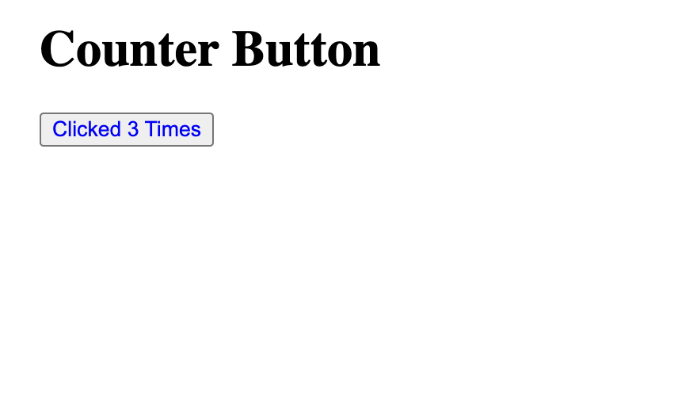

Note that you don't need to clone this repo, as you can create every necessary file by yourself.

# Pre-requisite

You won't need these until step 5.

Node / NPM see https://nodejs.org/en/download/current for installation instructions.

Install http-server (or another simple http server):  
`npm i http-server`

# Assignment

1. Create the index.html file using the following starting code.

```HTML
<!DOCTYPE html>
<html lang="en">
	<head>
		<meta charset="utf-8">
		<title>Web Components</title>
		<meta name="viewport" content="width=device-width, initial-scale=1.0">

		<style type="text/css">
			body {
				margin: 0 auto;
				max-width: 40em;
				width: 88%;
			}

            button {
                color: blue;
            }
		</style>
	</head>
	<body>

		<h1>Counter Button</h1>
        
        <script type="text/javascript" src=""></script>
	</body>
</html>
```

2. Add a webcomponent file with the following code:
```Javascript
customElements.define('counter-button', class extends HTMLElement {

    /**
     * The class constructor object
     */
    constructor () {
        // Always call super first in constructor
        super();

        // Render HTML
        this.innerHTML = `Hello world`;
    }

    /**
     * Runs each time the element is appended to or moved in the DOM
     */
    connectedCallback () {
        let instance = this;
    }
});
```

You can add the webcomponent by providing the HTML tag: `<counter-button></counter-button>` in the index.html file. You should now see Hello world on the webpage.

3. Create a button that increments it's value by changing the functionality in `this.innerHTML`. And by changing the connectedCallback function. You could read more on this at https://developer.mozilla.org/en-US/docs/Web/API/Web_components/Using_custom_elements

4. Include the javascript in the html page to add the web component to the page. It should look something like this:
  

5. Try to include the javascript remotely from `http://localhost:8080/web-component.js`. (by running http-server)

6. Add the button one more time. What happens to the page? What if you click both buttons a few times?

7. Let your creative juices flow, maybe add another web component to the page from a URL that is not on localhost?
You could use https://cdn.jsdelivr.net/gh/veslav3/webcomponent-workshop/web-component.js for this.